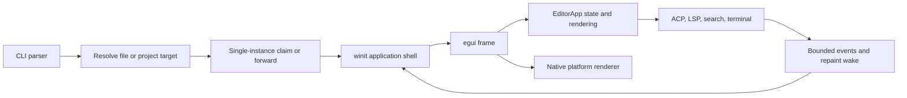
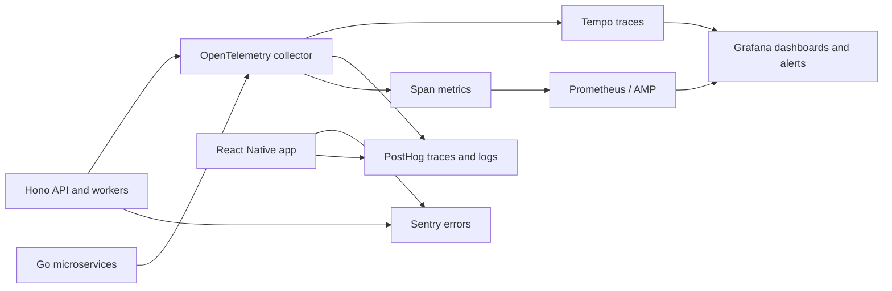

# Aura internal editor plan

## 1. Purpose

This document describes how Editur works today, how Aura is structured, and the smallest architecture that can turn Editur into a useful company-internal developer cockpit.

The intended reader is an Aura engineer who has not studied Editur. After reading this document, that engineer should be able to implement the first internal sidebar and add later tools without returning all new behavior to the main application module.

This plan reflects the working trees inspected on 2026-08-11. Both Aura repositories and Editur already contain unrelated in-progress changes. The implementation must preserve those changes and land in vertical slices.

## 2. Decision summary

Build company tools into Editur as code-owned, compiled-in workbench views. Do not build a general extension system yet.

The first release should add:

1. An activity rail with Explorer and Aura views on the left.
2. A small, static catalog of Aura tasks and links.
3. A bounded background task controller for non-interactive commands and logs.
4. A Change Health view that selects relevant checks for the two Aura repositories.
5. Deep links to the existing Aura admin tool for dashboards, users, prompts, evals, queues, traces, and infrastructure.
6. Verification that the existing Aura Admin MCP works through Editur's Cursor ACP session before any native MCP client is considered.

Keep the existing Agent view on the right and Terminal on the bottom. Those are already good boundaries and should not be folded into a new abstraction.

The extension decision is intentionally deferred. Revisit an out-of-process extension host only when a second team needs to ship and version a tool independently of Editur. Do not load third-party code into the editor process.

## 3. Why this is the right size

Editur already has the difficult primitives needed for an internal cockpit:

- Native cross-platform windowing and rendering.
- Editor panes, file tree, search, terminal, settings, keybindings, and LSP.
- Bounded background controllers for ACP and LSP.
- Project discovery and recent-project switching.
- Atomic persistence and careful process shutdown.
- A mature ACP agent sidebar that can consume project context and tool results.

Aura already has the difficult company systems:

- A large authenticated admin application.
- Read-only admin MCP tools with browser OAuth.
- Admin APIs for users, analytics, traces, prompts, evals, queues, and infrastructure.
- Prompt validation, publishing, trace export, replay, and eval workflows.
- OpenTelemetry, Tempo, Jaeger, Grafana, Prometheus/AMP, PostHog, and Sentry.
- Local development scripts for the API, workers, Redis, browser service, tunnel, and admin tool.

Rebuilding either side would create a second editor platform or a second admin platform. The useful gap is a thin workbench layer that connects them.

## 4. Current Editur architecture

### 4.1 Runtime lifecycle

Editur is a native Rust application using `winit` for the event loop, `egui` for immediate-mode UI, and direct platform renderers:

- Metal on macOS.
- Direct3D 12 on Windows.
- Vulkan on Linux.

There is no browser runtime, webview, Electron shell, or `wgpu` abstraction.



The CLI supports opening a path, updating the installed binary, forwarding to the resident process, and hidden commands used to launch or provision managed ACP providers.

The application shell owns:

- Window creation and restored geometry.
- Native renderer creation and resize.
- Input translation between `winit` and `egui`.
- Clipboard access.
- Repaint scheduling.
- Single-instance events.
- Clean shutdown and window geometry persistence.

The shell is deliberately thin. Product state lives in `EditorApp`.

### 4.2 Workbench layout

The normal editor layout has four stable zones:

| Zone | Current content | State owner |
| --- | --- | --- |
| Left | File explorer | `EditorApp` tree state and `TreeSurface` |
| Center | One to eight split editor panes | `EditorApp`, `PaneLayout`, and per-file tabs |
| Bottom | Split terminal sessions | `TerminalPanel` |
| Right | ACP agent session | `EditorApp`, `AgentState`, and one controller per provider |

Settings replace the normal workspace with a full-window view. Agentic mode replaces the editor center with project/session navigation, transcript, and optional diff view. Project search is a floating overlay. In-file search belongs to each pane.

The layout math is already isolated into pure functions and `PaneLayout`, which is why pane splitting and drag previews have strong tests. Sidebar selection is not isolated: it is represented by booleans and rendered directly by `EditorApp`.

### 4.3 Central state

`EditorApp` is the product's gravitational center. It currently owns:

- Open tabs and per-pane active files.
- File tree and project history.
- Search and find state.
- Explorer, terminal, and agent visibility and dimensions.
- Agent controllers, transcripts, permissions, attachments, sessions, and diffs.
- Settings drafts and keybinding UI.
- LSP controllers, requests, diagnostics, completion, hover, and definitions.
- Vim state and overlays.
- Dialogs, toasts, clipboard requests, and window actions.

This is workable for a focused editor, but it makes each new workbench surface expensive. Adding a sidebar today requires fields in `EditorApp`, layout edits, drawing code, focus rules, keybinding variants, command metadata, execution branches, settings/search changes, and UI tests in the same large module.

That centralization—not the lack of dynamic loading—is the immediate extensibility problem.

### 4.4 File and editor model

Each open file is a `FileTab` containing:

- A `Buffer` with text, revision, line index, dirty state, disk fingerprint, file mode, and line-ending style.
- An `EditorSurface` with cursor, selection, undo, editing, layout, and input behavior.
- Syntax-highlight and retained-layout caches.
- Pane membership.
- Markdown preview and agent diff state.
- Per-file Vim state.

Opening a file creates or reuses a tab. Closing a dirty tab is mediated by a pending action and dialog. A project switch is also mediated by the same unsaved-change path.

Saving is intentionally defensive:

- Reject binary and invalid UTF-8 input on load.
- Preserve LF or CRLF and file permissions.
- Compare the on-disk fingerprint before replacing a file.
- Stage, flush, sync, and atomically persist the replacement.
- Show Reload, Save As, or Cancel on an external-edit conflict.
- Never overwrite a dirty editor buffer during external reconciliation.

Company tools must not bypass this path when they open or edit files.

### 4.5 Commands and input

Keybindings use three compile-time pieces:

1. A `Command` enum.
2. A static command catalog containing stable ID, label, category, scopes, repeatability, and text-change behavior.
3. A central execution match in `EditorApp`.

The resolver supports platform-aware logical and physical chords, profiles, conflicts, Vim scopes, and terminal fallthrough. Settings serialize deviations from built-in profiles rather than copying full profiles.

This command system is strong and should stay static for built-in tools. A new internal action should receive a stable command ID and flow through the same catalog. A dynamic command registry would weaken exhaustive matching and is not required for the recommended architecture.

Editur does not currently have a command palette, even though it already has nearly all required metadata. Reusing the command catalog for a command palette is a high-value, small addition once the Aura view exists.

### 4.6 Background work

Editur has three useful concurrency patterns:

| Component | Pattern | Important invariant |
| --- | --- | --- |
| ACP agent | Dedicated thread, bounded async command channel, bounded synchronous event channel | Provider process is stopped and joined on drop |
| LSP | Dedicated thread, bounded command and event channels, debounce timers | Open documents and requests are revision-tagged |
| Project search | Background indexing/search with polling only while a query is active | No recursive work before the first non-empty query |

Both ACP and LSP wake the native event loop when an event arrives. The UI polls events at frame boundaries and mutates UI-owned state on the main thread.

The Aura task runner should copy this pattern. It should not run `Command::output`, HTTP calls, Git, Bun, Go, or Docker work on the UI thread.

### 4.7 Terminal

The terminal is already a capable native PTY surface with:

- Multiple sessions and split panes.
- Bounded scrollback.
- Resize and drag handling.
- Shell-compatible input and terminal control-key fallthrough.
- Child-process cleanup on drop.

Keep it for interactive commands. Do not turn it into the task runner. A task runner needs deterministic argv, status, captured bounded output, duration, cancellation, and structured completion. The terminal can offer an “Open interactively” action for commands that genuinely need a TTY.

### 4.8 LSP

Language servers are discovered from the user's environment and launched lazily per project and preset. The controller supports diagnostics, completion, hover, and definition with revision-tagged requests and bounded protocol frames.

The Problems view proposed later should aggregate the existing diagnostics; it should not introduce a second language-server connection.

### 4.9 ACP agent

The Agent feature already provides:

- Cursor and Codex provider selection.
- Managed, pinned provider provisioning.
- Provider-owned authentication.
- Session history where advertised.
- Streamed text, thoughts, plans, tool activity, diffs, attachments, usage, permissions, questions, and cancellation.
- File reconciliation after agent work.
- Per-provider state isolation.
- Bounded in-memory transcripts and file baselines.

This is important for Aura because the backend repository already contains an Aura Admin MCP endpoint configuration. The cheapest company integration may already exist: Cursor ACP can discover that project configuration, authenticate in the browser, and expose Aura's read-only tools inside Editur's Agent view. Phase 0 must prove or disprove that before native MCP code is written.

### 4.10 Persistence

Editur stores small, bounded JSON files in its application data directory:

- Settings.
- Recent projects.
- Window geometry.
- Selected ACP provider.
- ACP active/hidden session metadata.
- Verified provider installations and receipts.

Writes that affect important preferences use atomic staging. Corrupt or oversized files generally fall back safely or return visible errors.

Internal tool preferences should use the existing settings file only for non-secret values such as the selected Aura view or task filter. Admin tokens, API keys, environment contents, and secret values must never enter settings JSON.

### 4.11 Rendering and performance

The editor uses immediate-mode UI but retains expensive paint geometry through renderer callbacks. Syntax highlighting is incremental and cached per tab. Tree rows are cached. Search polling is conditional. Repaint deadlines allow the event loop to sleep when idle.

New views must follow the same rules:

- No filesystem recursion, Git command, network request, JSON parsing of large responses, or subprocess wait in a frame.
- Cache derived rows until their source revision changes.
- Request repaint only while a task is active, an event is pending, or an animation is running.
- Bound every output list and text buffer.
- Keep secrets and high-cardinality data out of paint-cache keys.

### 4.12 Testing and release shape

Editur has three test layers:

- Unit tests beside pure modules.
- Large headless `egui` behavior tests for layout and interaction.
- Integration tests with fake ACP and LSP processes.

CI tests and builds native artifacts for macOS, Linux, and Windows. The release path also packages pinned ACP provider runtimes and verifies them.

The existing tests are strongest when behavior is expressed as pure state transitions or bounded controller events. The workbench refactor should create those seams rather than testing pixel details or implementation trivia.

### 4.13 Current extensibility gaps

The gaps to solve are concrete:

- One large module owns most product state and rendering.
- Explorer and Agent visibility are unrelated booleans rather than selected workbench views.
- Settings sections and keybinding scopes are static and edited centrally.
- There is no task model or task-output surface.
- There is no general command palette.
- There is no workspace model for two sibling Git repositories.
- There is no structured local diagnostics view for Editur itself.
- There is no URL-opening helper for authenticated company web tools.
- Network support is used for updates/provisioning, not application APIs.
- There is no webview and no reason to add one for the first release.
- There is no extension permission model, ABI, SDK, package format, or isolation boundary.

Only the first eight gaps are required for the initial cockpit. Application API networking and a webview are deliberately deferred; the last gap is a reason not to claim an extension system exists.

## 5. Current Aura architecture

### 5.1 Repository topology

The linked Aura directory is a container for two independent Git repositories rather than one Git repository:

| Repository | Role | Main stack |
| --- | --- | --- |
| `aura-hono-api` | API, workers, AI agent, admin tool, prompts, evals, database queries, microservices, and infrastructure | Bun, TypeScript, Hono, Gel, InstantDB, Redis/BullMQ, Go, Pulumi |
| `auraRN` | iOS-first customer application and native modules | Expo, React Native, TypeScript, Swift, Kotlin, InstantDB, Zustand |

The internal editor should understand this as one company workspace with two Git roots. Git status, changed-file checks, and task working directories must remain repository-specific.

### 5.2 Backend and worker system

The backend is a large Hono application with:

- Public/product routes for contacts, conversations, images, users, notifications, voice, browser automation, social integrations, tracking, and content.
- Admin routes under an authenticated namespace.
- A main BullMQ worker process with many queues and scheduled/reconciliation jobs.
- Gel as a primary data system with generated query modules and hundreds of migrations.
- InstantDB for realtime/mobile-facing data.
- Redis for queues, locks, caches, streams, and coordination.
- Multiple AI providers, prompt templates, tool definitions, memory systems, and agent traces.
- Go services for browser sessions, tunneling, shared proxy/auth behavior, and Mongoose/attestation work.
- Pulumi-managed AWS services.

Project instructions prohibit inline Gel/EdgeDB queries and swallowed errors. Any editor-generated workflow must invoke the existing generated-query and error-logging paths rather than making database access “convenient” by bypassing them.

### 5.3 Mobile application

The mobile repository is an iOS-first Expo/React Native application with:

- Expo Router screens for onboarding, chat, settings, AI photos, search, points, and legal flows.
- Social integrations for Instagram, Snapchat, WhatsApp, Gmail, iMessage, and device tunneling.
- React Native state built around Zustand, React Query, InstantDB, and secure local storage.
- Many custom native modules, including message lists, background keep-alive, contact save, media, and social integration bridges.
- Sentry and PostHog instrumentation.
- Bun unit tests, lint/type checks, Maestro flows, Expo/EAS build workflows, and standalone Swift checks for selected modules.
- Multiple application variants, with Know What To Say as the current default.

Useful editor tools should make the correct variant and platform explicit. They should not silently run an Android or production EAS build.

### 5.4 Existing admin application

The backend contains a separate TanStack Start admin SPA with authenticated typed Hono clients. It already implements the kinds of rich UI that would be costly and inferior to recreate in native `egui`.

Its top-level areas are:

- Dashboard.
- Data and analytics.
- Infrastructure.
- Prompts.
- Users.
- Testing.
- Evals.
- VC groups.

Its route set includes:

- Growth, memory, nudges, prompt cache, integration health, tool calls, wake/sync health, and browser-agent failures.
- Grafana, Jaeger, QueueDash, Redis, Gel UI, InstantDB, alerts, secrets, and admin MCP setup.
- Prompt render, compare, versions, macros, and tool configuration.
- User profiles, messages, knowledge, persons, media, social accounts, browser sessions, and guarded actions.
- Test-user creation, notification testing, nudge diagnosis, search, typing indicators, and Snapchat previews.
- Eval runs, cases, and trends.

The SPA already has command search, auth, error boundaries, Sentry, PostHog, React Query caching, and browser-specific integrations. Editur should deep-link to these routes for rich or sensitive operations.

### 5.5 Admin APIs and MCP

The backend exposes authenticated admin APIs used by the SPA. It also exposes an Aura Admin MCP server with browser OAuth and a manual bearer-token fallback.

The MCP server is deliberately read-only and already offers tools for:

- Current admin identity.
- User search, profiles, usage, contacts, classifications, suggestions, media, conversations, facts, memories, and browser sessions.
- Message, prompt, reasoning, and browser-agent traces.
- Analytics summaries, growth, daily activity, nudges, memory, LLM performance, tool calls, and integrations.
- Queue health and alert rules.
- Eval runs, cases, and trends.
- Prompt versions and comparisons.
- Dashboard feed and VC groups.

This is the preferred remote data boundary. It already handles authorization, read-only policy, response shaping, and sensitive-data expectations.

The repository contains a project-level Cursor MCP configuration pointing at the production endpoint. That makes an ACP smoke test the first integration step.

### 5.6 Prompt, trace, and eval workflows

Prompts are source-controlled directories with templates, parameter schemas, optional tool configurations, macros, and a versions manifest. Existing scripts can:

- Generate and validate prompt assets.
- Check prompt drift and Nunjucks compilation.
- Render a prompt.
- Pull and publish prompt versions.

The trace tooling can:

- Export a production trace into a replay bundle.
- Redact secrets and inline media.
- Replay an agent loop or a single-shot call.
- Preserve recorded prompts and tool outcomes.
- Inject queued messages at recorded boundaries.

The eval harness supports:

- Agent-loop and single-shot cases.
- Deterministic and LLM grading.
- Multiple trials and timeouts.
- Red baselines, reference responses, and counterexamples.
- Run history, pass rates, stability classification, and trends.
- A Gel-backed control plane and isolated branch workflow.

These capabilities are unusually well suited to an editor cockpit because their outputs naturally link back to prompt files, case files, source, and traces.

### 5.7 Observability

Aura's observability path is already broad:



The backend also has:

- Structured logging correlated with active OTel trace and span IDs.
- Request tracing middleware and route lifecycle logging.
- Event-loop stall watchdogs.
- Worker lifecycle logs and traced worker processors.
- Agent-run traces persisted for replay.
- Admin proxies and short-lived embed tokens for Grafana and Jaeger.
- Grafana alert routes and contact-point infrastructure.

Editur should present and correlate this data, not create a new telemetry backend.

## 6. Product contract for the internal editor

### 6.1 Primary jobs

The internal editor should make these loops fast:

1. Open the Aura workspace and see both repositories and their change health.
2. Start the exact local services needed for the current task.
3. Run the smallest relevant check and open failures at source.
4. Inspect a user, message, trace, queue, alert, prompt, or eval without hunting for URLs.
5. Move from an operational symptom to the relevant trace, source file, prompt, or eval case.
6. Ask the coding agent to investigate Aura through the existing read-only MCP tools.
7. Keep production mutations in the authenticated admin UI with explicit confirmations.

### 6.2 Non-goals for the first release

- A VS Code-compatible extension API.
- Arbitrary JavaScript, Lua, WASM, or dynamic-library loading.
- A webview or embedded copy of the admin SPA.
- A second database browser, trace UI, queue UI, prompt CMS, or eval dashboard.
- Storing company credentials in Editur settings.
- Running arbitrary repository scripts discovered from `package.json`.
- Native production write operations.
- Replacing the interactive terminal.
- Replacing the Aura admin application.
- A generic multi-company configuration schema.

### 6.3 Safety invariants

- UI frames never wait on a child process or network request.
- Captured output, event queues, response bodies, and history are bounded.
- Child processes are cancellable and joined on shutdown.
- Tasks use an argv array and fixed working directory; no shell interpolation for editor-supplied values.
- Repository detection never reads `.env` files.
- Secret values are never logged, painted, persisted, attached to agent prompts, or copied without an explicit user action.
- Remote company data is read-only in native views.
- Destructive or production-mutating actions open the existing admin UI or require a dedicated confirmed workflow.
- File changes continue through the existing buffer/save/reconciliation path.
- Git status and commands stay inside the detected repository root.
- Aura-specific views remain hidden outside a recognized Aura workspace.
- Every background error becomes visible; none are swallowed.

## 7. Architecture options

| Option | Benefit | Cost | Decision |
| --- | --- | --- | --- |
| Keep adding fields and drawing functions to `EditorApp` | Fastest first patch | Makes every later tool harder and increases borrow/layout coupling | Reject |
| Static compiled-in workbench views | Small refactor, exhaustive Rust matching, no plugin security model, easy to test | Requires an Editur release to add a tool | Choose now |
| Out-of-process extension host over versioned JSON-RPC/MCP | Independent releases and crash isolation | Protocol, lifecycle, permissions, packaging, compatibility, and declarative UI work | Revisit on trigger |
| In-process dynamic libraries | Native UI and performance | Unsafe ABI, crashes take down the editor, signing and compatibility burden | Reject |
| WASM/Lua/JavaScript plugins | Portable sandbox story in theory | Runtime, capabilities, UI API, filesystem policy, debugging, and packaging | Reject until proven necessary |
| Embedded admin webview | Reuses existing SPA inside the window | Large platform dependency, cookie/OAuth complexity, GPU/input/accessibility risks | Defer; use browser deep links |

## 8. Recommended workbench architecture

### 8.1 Static view model

Introduce only the IDs the product needs:

```text
PrimaryView = Explorer | Aura
BottomPanel = Terminal | Tasks | Problems
SecondaryView = Agent
```

Do not introduce a trait, factory, dynamic registry, or serialized manifest in the first slice.

Use one static metadata table for labels, icons, default placement, and stable command IDs. Use an exhaustive match to render each view. A new built-in view then requires:

1. One enum variant.
2. One metadata row.
3. One state module.
4. One render branch.
5. Relevant commands and focused behavior checks.

This is enough to make additions routine while preserving compile-time coverage.

### 8.2 Layout state

Replace the left-sidebar boolean with:

- `primary_open: bool`.
- `primary_view: PrimaryView`.
- Existing bounded width and drag state.

Keep the Agent sidebar state separate because it is a simultaneous secondary view, not another mutually exclusive left view.

Replace the terminal boolean with:

- `bottom_open: bool`.
- `bottom_panel: BottomPanel`.
- Existing bounded height and drag state.

The existing split functions should continue to compute rectangles. The change is which module draws into the rectangle, not a new layout engine.

### 8.3 Activity rail

Add a narrow left activity rail containing Explorer and Aura buttons. It should:

- Select and open a view on click.
- Collapse the selected view when clicked again.
- Expose accessible labels and selected state.
- Use existing icon, theme, hover, and focus patterns.
- Leave the editor full width when collapsed.
- Stay present in IDE and agentic layouts only if it contains an applicable view.

Do not add badges, drag reordering, user customization, or arbitrary contributions initially.

### 8.4 Module boundaries

Move only code needed to create clear ownership:

| Module | Owns |
| --- | --- |
| Workbench | Selected views, open state, widths/heights, static metadata, and layout transitions |
| Explorer | Tree state, tree prompts, clipboard actions, selection, and drawing |
| Tasks | Task definitions, controller, output state, cancellation, and task panel |
| Aura | Workspace recognition, repository roots, task grouping, links, and small health summaries |
| Problems | Projection of existing LSP diagnostics and task failures |

Do not extract editor tabs, LSP, Agent, terminal, settings, and every helper as a prerequisite. Move code when the first vertical slice needs it.

### 8.5 Aura workspace recognition

Recognition should be deterministic and local:

- Container root: contains both backend and mobile package manifests with expected package names.
- Backend root: package name is `aura-hono-api`.
- Mobile root: package name is `aura` and the Expo configuration is present.

The detector reads only small manifest files with size bounds. It must not inspect environment files, Git remotes, credentials, or arbitrary project code.

When the container root is open, represent the backend and mobile directories as separate repositories. When one repository is open directly, show only applicable tasks and links.

Do not create a generic workspace manifest until a second multi-repository company workspace needs one.

### 8.6 Task model

Tasks are static Rust data, not parsed from package scripts:

```text
TaskSpec
  id
  label
  repository
  executable
  argv
  working-directory selector
  kind: check | dev-service | utility
  interactive: yes/no
  concurrency group
  confirmation level
```

Why static definitions:

- The exact safe commands are reviewed with Editur.
- Production/deployment commands cannot appear by accident.
- Working directories and variants are explicit.
- Labels and expected behavior stay stable.
- Cross-platform availability can be reported clearly.

The first task set should include only:

- Backend type check.
- Backend prompt checks.
- Backend targeted or full unit tests.
- Backend Go tests.
- Admin tool type check and tests.
- Mobile type check, lint, and unit tests.
- Backend local dev.
- Backend + worker + admin tool local dev.
- Mobile Metro start.
- iOS simulator run.

EAS production builds, deploys, migrations, prompt publishing, secret sync, data backfills, and destructive utilities stay out of the first task set.

### 8.7 Task controller

Use the existing controller pattern:

- Dedicated worker thread per running task or a small bounded task manager.
- Bounded command channel: Start, Cancel, Shutdown.
- Bounded event channel: Started, Output, Finished, Failed.
- Fixed stdout/stderr retention limit with a visible truncation marker.
- Start time, duration, exit status, and working directory in state.
- Process-group termination using the same cross-platform practices as ACP/LSP.
- Event-loop wake callback.
- Shutdown drains events and joins workers.

One task per concurrency group is enough initially. For example, only one backend dev stack and one mobile dev stack may run. Do not build a scheduler or DAG.

Interactive tasks open in Terminal. Captured tasks use the task controller. Do not attempt to emulate terminal behavior in the log view.

### 8.8 Change Health

Change Health should answer “what is the smallest useful check for my current changes?”

Initial behavior:

1. Run `git status --porcelain` independently in each recognized repository.
2. Classify changed paths with a small ordered ruleset.
3. Offer, but do not automatically start, the relevant check tasks.
4. Show last result and duration.
5. Open a failed file or task output.

Examples:

- Prompt template or schema change → prompt validation and nearby prompt tests.
- Backend TypeScript change → backend type check plus the explicitly selected test.
- Go microservice change → tests for that service.
- Admin tool change → tool type check and tests.
- Mobile TypeScript change → mobile type check and unit tests.
- Native iOS module change → mobile type check plus the documented native build/test command, only on macOS.

Do not invent dependency-graph analysis. Path classification is enough until it produces demonstrably poor suggestions.

### 8.9 Command palette

Add a command palette backed by the existing command catalog after the Aura view can register its static commands.

It should search command ID, label, category, and bound keys, then execute through the existing command path. This provides a single home for actions such as:

- Focus Aura.
- Toggle Tasks.
- Run recommended checks.
- Open Grafana.
- Open Jaeger.
- Open Admin Users.
- Open Prompt Compare.
- Ask Agent to investigate current failure.

Do not add arbitrary command arguments or extension commands in the first release.

### 8.10 Web links

Add one cross-platform URL-opening helper that accepts only parsed HTTPS URLs. Aura link definitions are compile-time constants or are derived from one validated admin base URL.

Use the system browser for:

- Dashboard and analytics.
- User details.
- Grafana and Jaeger.
- QueueDash and Redis browser.
- Prompt versions and compare.
- Eval runs and cases.
- Admin MCP setup.
- Sentry and PostHog links where a stable URL exists.

The native editor must not append bearer tokens to URLs. Let the browser's existing admin session authenticate.

### 8.11 MCP integration ladder

Stop at the first rung that works:

1. Verify Aura Admin MCP inside the existing Cursor ACP session.
2. If successful, add prompt shortcuts that ask the Agent to use named read-only Aura tools.
3. If ACP does not expose the configured MCP, fix or configure that provider path.
4. Build a native MCP client only if engineers need structured data outside an agent conversation often enough to justify separate auth and protocol code.

A native MCP client would require:

- Streamable HTTP support.
- OAuth discovery, dynamic client registration, PKCE, browser launch, and loopback callback.
- In-memory tokens initially; OS credential storage only if persistent login becomes necessary.
- Strict response and timeout bounds.
- Read-only tool allowlisting.
- Redaction and audit events.
- Fake-server protocol tests.

Do not use a manually pasted long-lived token as the default product experience.

### 8.12 Problems view

Problems should merge existing signals without owning them:

- Current LSP diagnostics.
- Failed task summaries.
- Optional parser results for standard compiler output.

Start with plain task failure rows and LSP diagnostics. Add compiler-output parsing one toolchain at a time only when opening the exact file/line is reliable.

### 8.13 Internal editor observability

The first release needs local diagnostics, not a second telemetry pipeline:

- Keep `EDITUR_LOG=debug` startup timing.
- Add bounded structured events for task starts, exits, cancellations, controller failures, and view load failures.
- Show those events in a local Diagnostics section with copy/export after explicit action.
- Record durations and exit codes, not command environment values or output by default.
- Keep UI frame timing benchmarks in the existing performance workflow.

Add OpenTelemetry export only if company deployment needs fleet-level editor reliability data. If added, use the existing Aura collector and an explicit endpoint setting; redact paths, prompts, code, terminal output, user data, and credentials. Do not add both Sentry and OTel to the Rust client without a measured need.

## 9. Tool ideas

The following backlog is intentionally larger than the first release. Priority means recommended order, not a promise to build every item.

### 9.1 Workspace and code navigation

| Idea | Value | Reuse | Priority |
| --- | --- | --- | --- |
| Aura activity view | One home for company workflows | New static workbench view | P0 |
| Two-repository status | Makes backend/mobile branch and dirty state visible together | `git status` subprocess | P0 |
| Change Health | Suggests the smallest relevant checks | Static tasks plus changed-path rules | P0 |
| Command palette | Makes built-in and Aura commands searchable | Existing command catalog | P0 |
| Problems panel | Combines diagnostics and failed checks | Existing LSP/task state | P1 |
| Related-file navigator | Jump between prompt, schema, test, route, and service counterparts | Small path conventions | P1 |
| Recent trace/source links | Reopen files reached from recent investigations | Existing tabs/project state | P2 |
| Workspace bookmarks | Pin common files and routes | Small bounded settings list | P2 |
| Ownership hints | Show repository/module ownership metadata | Add only if authoritative metadata exists | P3 |

### 9.2 Local development and tasks

| Idea | Value | Reuse | Priority |
| --- | --- | --- | --- |
| Backend dev stack control | Start API, worker, admin tool, and prompt watcher together | Existing `dev:tool` script | P0 |
| Mobile Metro control | Start the default app variant correctly | Existing mobile script | P0 |
| Task output panel | Captured logs, duration, status, cancellation | New bounded controller | P0 |
| Port/service health | Show API, tool, Redis, browser, and tunnel readiness | TCP/HTTP health probes on a worker | P1 |
| Log filter presets | Focus on agent, Instagram, Snapchat, queue, or error logs | Existing scripts and bounded output | P1 |
| Open task in terminal | Escalate a captured task to an interactive session | Existing terminal | P1 |
| Go service launcher | Start browser, tunnel, or Mongoose service alone | Existing scripts | P1 |
| Dev branch environment | Create/teardown isolated backend environments | Existing guarded scripts | P2 |
| Simulator/device picker | Make iOS destination explicit | `xcrun` discovery | P2 |
| Local dependency readiness | Report Bun, Go, Redis, Docker, Xcode, LSP tools | Version probes | P2 |
| Project-scoped cache report | Show Editur target and relevant local build sizes | Filesystem metadata | P2 |

### 9.3 Prompt and AI development

| Idea | Value | Reuse | Priority |
| --- | --- | --- | --- |
| Prompt file recognition | Show prompt name, schema, macros, and tool config together | Existing prompt directory contract | P1 |
| Prompt validation action | One-click generated-asset and schema checks | Existing prompt scripts | P1 |
| Local prompt render preview | Render with selected fixture/context and open output | Existing render script | P1 |
| Prompt version compare | Move from source to published differences | Existing admin route/API | P1 |
| Prompt drift indicator | Warn when generated assets are stale | Existing drift check | P1 |
| Eval case navigator | Open cases related to the current prompt | Existing eval case metadata | P1 |
| Eval run panel | Start a scoped local workflow and show result receipt | Existing eval workflow | P1 |
| Red/green gate shortcut | Run the existing gate for a selected case | Existing gate script | P1 |
| Trace replay action | Export/replay a selected production trace safely | Existing trace scripts | P2 |
| Prompt provenance inspector | Compare recorded and current prompt sources | Existing replay bundle data | P2 |
| Tool configuration editor aids | Validate tool JSON and open admin compare | Existing schema/tool UI | P2 |
| Agent context shortcut | Attach current failure, diff, or trace reference to ACP | Existing Agent attachments/prompt | P1 |

### 9.4 Observability and incident response

| Idea | Value | Reuse | Priority |
| --- | --- | --- | --- |
| Observability launcher | One-click Grafana, Jaeger, QueueDash, Redis, Sentry, PostHog | Existing admin/browser routes | P0 |
| Queue health summary | See failing/stalled queues without leaving editor | Admin MCP `get_queue_health` | P1 |
| Alert rule summary | See current alert state | Admin MCP `list_alert_rules` | P1 |
| Trace lookup | Search by message/user/trace ID and open timeline | Admin MCP and admin routes | P1 |
| Reasoning trace view | Correlate agent decisions, prompts, tools, and source | Existing trace APIs/UI | P1 |
| Browser-agent failure triage | Open failure groups and related user sessions | Existing analytics routes/MCP | P1 |
| Nudge diagnosis | Run the existing read-only diagnostic path | Existing admin tool and MCP | P1 |
| Wake/sync health | Correlate mobile background telemetry and backend jobs | Existing analytics page | P1 |
| Local/remote trace correlation | Copy active trace ID from logs into admin lookup | Existing structured logs | P2 |
| Event-loop stall view | Surface watchdog incidents and relevant routes | Existing logs/traces | P2 |
| Incident scratchpad | Pin source, trace, user, queue, and notes for one incident | Local bounded state | P3 |

### 9.5 Users, data, and integrations

| Idea | Value | Reuse | Priority |
| --- | --- | --- | --- |
| Read-only user search | Quick support/debug lookup | Admin MCP `search_users` | P1 |
| User investigation launcher | Open profile, messages, knowledge, media, and social pages | Existing admin routes | P1 |
| Integration health | Instagram, Snapchat, Gmail, and other connection health | Existing MCP/analytics | P1 |
| Conversation/message lookup | Move from an ID in logs to the admin view | Existing admin routes/MCP | P1 |
| Memory inspector link | Open facts, observations, relationship memory, and gossip | Existing admin UI/MCP | P2 |
| Browser session lookup | Inspect browser-agent session details | Existing admin UI/MCP | P2 |
| Test-user launcher | Open guarded create-user/testing flows | Existing admin UI | P2 |
| Data browser launcher | Open Gel UI or InstantDB through existing auth | Existing proxies/pages | P1 |
| Guarded user actions | Deep-link only; keep confirmation in admin SPA | Existing admin UI | P2 |

### 9.6 Mobile development

| Idea | Value | Reuse | Priority |
| --- | --- | --- | --- |
| Variant-aware task selector | Prevent wrong-app builds | Existing variant definitions | P1 |
| iOS simulator run | One-click documented default | Existing mobile script | P1 |
| Device log presets | Focus social/background-sync traces | Existing log flags/scripts | P1 |
| Deep-link launcher | Open a known app route on simulator/device | Expo tooling | P2 |
| Screenshot-to-Agent | Attach simulator screenshot to ACP | Existing image attachments | P2 |
| Native module check | Offer the correct Swift/build check for changed module | Existing documented commands | P2 |
| EAS build status link | Open the correct project/profile page | Browser deep link | P2 |
| Maestro runner | Run the small mobile flow suite explicitly | Existing Maestro task | P2 |
| Push/wake test launcher | Open existing admin testing pages | Existing admin UI | P2 |

### 9.7 Delivery and repository health

| Idea | Value | Reuse | Priority |
| --- | --- | --- | --- |
| CI launcher | Open the relevant repository/action run | Browser link from Git metadata | P1 |
| Local preflight | Run repository-specific check bundle | Static task group | P1 |
| Generated-asset status | Detect prompt/query drift before CI | Existing checks | P1 |
| Migration status | Show pending Gel migrations without applying | Existing Gel CLI, read-only command | P2 |
| Release profile guard | Display selected mobile app/profile before launch | Existing EAS config | P2 |
| Deployment link | Open infrastructure/deployment UI | Existing provider page | P2 |
| Backfill catalog | Search scripts and open source only | Existing scripts | P3 |
| Backfill execution | Keep out until a dedicated approval/audit design exists | None yet | Defer |

## 10. Delivery plan

### Phase 0: prove zero-code integrations

Goal: remove uncertainty before refactoring.

Checks:

1. Open the backend repository in Editur.
2. Start Cursor from the Agent sidebar.
3. Confirm the project-level Aura Admin MCP is discovered.
4. Complete browser OAuth.
5. Ask for current admin identity and queue health.
6. Confirm tool activity is visible and bounded in Editur.
7. Confirm no token or sensitive response is written to Editur settings or logs.
8. Record which admin URLs are stable for deep links.

Output: a short compatibility note in this plan or the ACP plan. No product code unless the existing ACP path is broken.

### Phase 1: workbench vertical slice

Goal: add Aura as a second primary view without changing editor behavior.

TDD sequence:

1. Add a pure state test for selecting, toggling, and reopening primary views.
2. Add `PrimaryView` and replace the left-sidebar boolean with workbench state.
3. Keep Explorer rendering unchanged behind the new state.
4. Add an empty Aura view with one static link.
5. Add the activity rail and accessible selection behavior.
6. Add stable Focus Explorer, Focus Aura, and Toggle Primary Sidebar commands.
7. Add one headless UI test proving editor geometry is unchanged when Explorer is selected and full-width when collapsed.

Acceptance:

- Existing explorer shortcuts behave the same.
- Agent and Terminal geometry are unchanged.
- Aura is hidden in an unrelated project.
- No background work runs merely because Aura is visible.
- Idle repaint behavior remains unchanged.

### Phase 2: Aura workspace and links

Goal: make the view immediately useful without credentials.

TDD sequence:

1. Test recognition for container, backend-only, mobile-only, malformed, and oversized manifests.
2. Show both repositories with branch and dirty counts from background Git probes.
3. Add browser links for admin dashboard, analytics, infrastructure, prompts, users, testing, evals, and MCP setup.
4. Add local links to open the corresponding repository root or important project files.
5. Add visible probe failures and manual Refresh.

Acceptance:

- No `.env` or credential file is read.
- Git probes cannot escape recognized roots.
- The UI stays responsive when Git is slow or unavailable.
- Browser links contain no token.

### Phase 3: tasks and Change Health

Goal: run and understand safe local checks.

TDD sequence:

1. Build a fake child process that emits stdout/stderr, exits, waits for cancellation, and spawns a child.
2. Test bounded output, completion, cancellation, process-tree cleanup, channel saturation, and drop.
3. Add the task controller and Tasks bottom panel.
4. Add the first backend and mobile check tasks.
5. Add changed-path classification tests.
6. Add Change Health recommendations and last-result state.
7. Add “Open interactively” for TTY tasks.

Acceptance:

- No shell string is assembled from dynamic values.
- Output truncation is explicit.
- Failed starts and nonzero exits are visible.
- Closing Editur leaves no task process behind.
- Tasks cannot run in the wrong repository.
- No production or destructive task is present.

### Phase 4: command palette and Problems

Goal: make the growing command set easy to use.

TDD sequence:

1. Test filtering over existing command metadata.
2. Add the palette and execute through the existing resolver path.
3. Add Aura link/task commands to the static catalog.
4. Add a Problems projection over LSP diagnostics and task failures.
5. Add source opening only for exact, validated paths and positions.

Acceptance:

- Keybinding behavior and Settings command search remain unchanged.
- The palette contains only commands the editor can execute.
- Problems does not start another LSP or rerun a task.

### Phase 5: prompt, eval, and trace workflows

Goal: support Aura's highest-leverage AI engineering loops.

Slices:

1. Prompt recognition and validation.
2. Local prompt render task.
3. Eval case navigation and scoped eval task.
4. Admin deep links for prompt compare, eval runs, and traces.
5. Agent prompt shortcuts that include current file, task failure, or trace identifier.
6. Optional replay task after its safety preconditions are represented clearly.

Acceptance:

- Prompt publish remains outside native tasks.
- Replays use existing guards and redaction.
- Eval failures link to cases and captured output.
- Agent shortcuts never silently attach secrets or production data.

### Phase 6: read-only native company data, only if needed

Trigger: engineers repeatedly leave Editur for the same small read-only answer even after Agent MCP and deep links exist.

Possible first slice:

- OAuth login.
- Current admin identity.
- Queue health.
- Alert summary.
- Recent eval runs.

Use the Aura Admin MCP rather than private database queries or duplicated admin API logic.

Stop if OAuth, MCP transport, or sensitive-data handling would require shortcuts. Browser and Agent paths remain valid fallbacks.

### Phase 7: extension-host decision gate

Do not start this phase based on a desire for architectural completeness.

Proceed only if all are true:

1. At least two internal tools are owned by different teams.
2. They need independent release cadence.
3. Static Editur releases are a measured bottleneck.
4. Their required UI can fit a constrained declarative component set or browser surface.
5. A permissions and package-signing owner exists.

If triggered, prefer an out-of-process host with:

- Versioned protocol negotiation.
- Signed packages or an internal allowlist.
- Declared capabilities for filesystem, subprocess, network, secrets, commands, and UI.
- Workspace-scoped permissions.
- Process isolation and timeouts.
- Declarative contributions for commands, views, tasks, and settings.
- No raw renderer or arbitrary in-process Rust access.

The current compiled-in modules become the reference implementations, not plugins retrofitted prematurely.

## 11. Minimal test strategy

Follow TDD where behavior branches or processes are involved. Do not add tests for enum existence, constant labels, or trivial forwarding.

### Pure tests

- Workbench view transitions.
- Workspace recognition and manifest bounds.
- Task applicability by repository/platform.
- Changed-path classification.
- Command filtering.
- URL validation and route construction.
- Output truncation and redaction.

### Controller tests

- Start, output, completion, cancellation, shutdown, and process-tree cleanup.
- Channel saturation behavior.
- Bounded stdout/stderr.
- Missing executable and invalid working directory.
- Event-loop wake callback.

### Headless UI tests

- Activity rail selection and collapse.
- Explorer geometry parity.
- Aura hidden for unrelated projects.
- Task state and cancellation controls.
- Problems rows open validated files.
- Agent/Terminal coexistence with the new left view.

### Manual native smoke matrix

- macOS first, because Aura mobile development is iOS-first.
- Linux and Windows for workbench, tasks, links, and shutdown.
- Backend-only, mobile-only, container root, and unrelated project.
- Missing Bun, Git, Go, Docker, Xcode, Redis, and browser session.
- Slow/hung task and saturated output.
- Dirty editor buffer while Agent or a task changes a file.
- Offline and expired admin session.

### Performance checks

- Idle Aura view causes no recurring repaint.
- Hidden views do no polling.
- Large Git status and task output remain bounded.
- Opening the activity rail does not invalidate editor paint caches.
- Startup remains lazy: no Aura detection beyond small manifests until a project is resolved.

## 12. Security and privacy review

Before any remote data appears natively, review these threats:

| Threat | Required control |
| --- | --- |
| Token disclosure | Browser OAuth, memory-only token first, no URL/query token, no settings persistence |
| PII in logs | Redact user content and identifiers by default; explicit copy/export |
| Command injection | Fixed executable and argv; validated paths; no shell interpolation |
| Wrong-environment action | Clear local/staging/production label and compile-time task policy |
| Accidental production mutation | Native remote views read-only; open admin UI for writes |
| Path escape | Canonicalize and verify repository/workspace boundaries |
| Child process leak | Process-group ownership, cancellation, drop tests |
| Unbounded output | Per-event, per-task, and total caps with truncation markers |
| Malicious project manifest | Small-file limits, strict expected fields, no executable manifest entries |
| Sensitive Agent context | Explicit attachments and prompts; preserve provider permission UX |
| Web link spoofing | HTTPS allowlist for company hosts; display destination in hover text |

If a future extension host is built, it requires a separate threat model. The static internal-tool architecture does not grant arbitrary project code new privileges.

## 13. Risks and controls

### Main application coupling

Risk: the workbench refactor becomes a rewrite of the large application module.

Control: move only Explorer/workbench state required by the first Aura slice. Preserve existing editor, Agent, LSP, terminal, and settings behavior behind the same methods.

### Duplicate admin UI

Risk: native cards grow into a second admin application.

Control: native views answer quick questions and deep-link to rich workflows. Use Admin MCP for shaped read-only data. Keep writes in the SPA.

### Task catalog sprawl

Risk: every package script becomes a button.

Control: include only frequent, reviewed, safe tasks. Search remains available in Terminal for everything else.

### Cross-platform drift

Risk: mobile/macOS commands make the editor unreliable elsewhere.

Control: explicit platform availability and tests; unavailable tasks explain why rather than disappearing silently.

### Sensitive observability data

Risk: traces, prompts, and user content leak into local logs or Agent context.

Control: read-only auth, redaction, bounded display, explicit copy/attach, and no persistence by default.

### Multiple Git repositories

Risk: status or commands run at the container root and produce incorrect results.

Control: recognize and store each Git root separately. Every task and Git probe names one root.

### Build size and disk

Risk: more Rust dependencies and incremental artifacts worsen local disk pressure.

Control: prefer existing dependencies and stdlib; add protocol/telemetry crates only when their phase begins. Monitor Editur's target directory and remove only Editur incremental caches when needed. Do not clean Aura caches as part of Editur work.

## 14. First-release definition of done

- Aura and Explorer are selectable primary views.
- Unrelated projects do not show Aura UI.
- The Aura container and both direct repositories are recognized safely.
- Backend and mobile Git status are shown independently.
- Safe check tasks can run, cancel, and report bounded output.
- Change Health recommends relevant checks without running them automatically.
- The task controller leaves no child process on editor exit.
- Admin, observability, prompt, eval, user, testing, and MCP pages open in the system browser without tokens in URLs.
- Cursor ACP either exposes Aura Admin MCP successfully or the compatibility gap is documented with a bounded follow-up.
- Commands are searchable through the command palette.
- Existing file safety, Agent, terminal, LSP, keybinding, and pane behavior remains intact.
- New non-trivial logic has focused tests; no test exists solely to mirror constants or implementation details.
- macOS, Linux, and Windows CI remain green.
- Editur startup and idle repaint performance stay within the existing baseline.

## 15. Recommended implementation order

The shortest path to useful value is:

1. Run the ACP/MCP smoke test.
2. Add static workbench view state and activity rail.
3. Add Aura workspace recognition and browser links.
4. Add the bounded task controller and Tasks panel.
5. Add Change Health.
6. Add the command palette and Problems projection.
7. Add prompt/eval/trace shortcuts.
8. Measure whether native MCP data is still necessary.
9. Revisit extensions only at the explicit ownership/release trigger.

This sequence makes Editur useful as a company editor by phase 3 without committing the codebase to an extension platform, embedded browser, credential store, or second admin UI.
