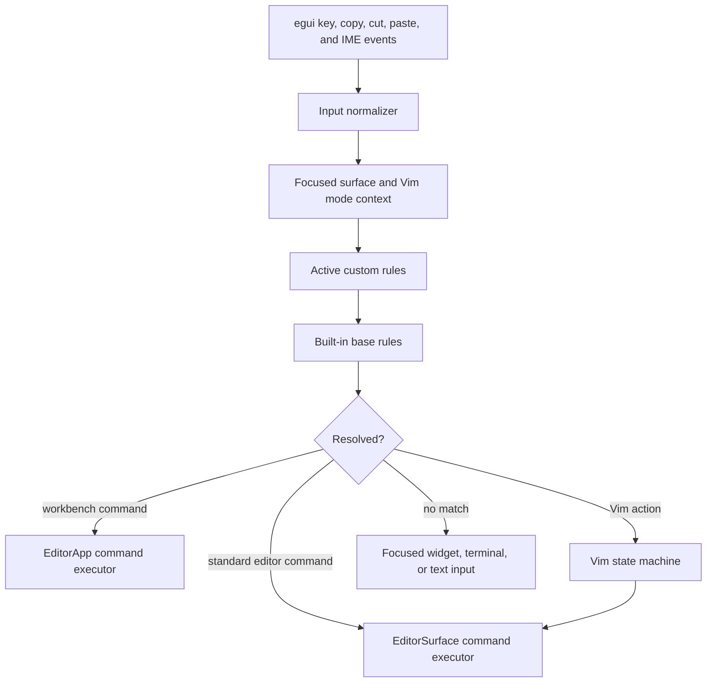

# Keybinding profiles implementation plan

## 1. Purpose

Add configurable keyboard profiles to Editur without turning the editor into a scripting or extension host. Ship two immutable built-in profiles—VS Code and Vim—and let users duplicate either profile, change bindings one at a time, or start a completely empty profile.

### Audience and outcome

This plan is for the engineer implementing the feature. After reading it, they should be able to add the command boundary, profile storage, Settings UI, VS Code preset, practical Vim mode, migration, tests, and release checks without reopening product or architecture decisions.

### Decision summary

- Use one stable catalog of Editur command IDs. UI buttons and keybindings invoke the same commands.
- Keep the VS Code preset declarative. It uses familiar platform-specific defaults, chords, and focused-surface scopes.
- Implement Vim as a small modal command engine that resolves operators, motions, counts, and text objects into the same editor commands. Vim is not representable as a flat shortcut table.
- Keep both built-in profiles immutable. The first edit creates and activates a derived custom profile.
- Let a new profile start from VS Code, Vim, or Empty. An empty profile chooses Standard or Vim editing behavior.
- Store only the active selection plus custom profiles and deviations in the existing global settings document.
- Extend the planned in-window Settings route. Do not add a second window, settings file, command palette, generic expression language, or new dependency.
- Use TDD for resolver precedence, persistence, modal edits, and integration boundaries. Do not snapshot every row or test trivial labels.

## 2. Current-state findings

Editur already has the necessary low-level input and persistence pieces, but no shared command layer:

- App-wide shortcuts are hard-coded in one application method. Save, search, sidebar focus, editor focus, and close are checked directly against `egui` input.
- Text editing shortcuts and navigation are hard-coded separately inside the retained editor surface. Undo, redo, selection, indentation, deletion, and cursor movement do not currently have reusable command IDs.
- Tree, find, project-search, Agent, file-picker, dialog, and terminal keyboard handling are local to their surfaces.
- `egui` input events contain logical and physical keys. This is enough to support layout-aware bindings and an opt-in physical-key-position binding without changing `winit`.
- Copy, cut, and paste arrive through special `egui` events rather than ordinary key events. The input router must normalize those events if those commands are to be configurable.
- The terminal intentionally translates unconsumed key and text events to PTY bytes. Profile bindings must not steal terminal control sequences unless a user explicitly creates a terminal-scoped or global rule.
- Each tab owns an editor surface and its undo history. This is the correct place for per-document Vim cursor/mode state; shared registers and last-search state belong to the application session.
- A typed, bounded, atomically saved global settings model is under development, and the existing LSP plan already specifies one full-window Settings route. Keybindings should extend both rather than create parallel infrastructure.
- There is intentionally no status bar. Vim mode should appear as a compact pill in the active pane header, not add a permanent new bar.

The implementation will touch hot input paths and an already large application module. Keep the feature concrete: one keybinding module, one Vim module, additions to the settings model, and UI composition in the application. Split further only after implemented code becomes difficult to navigate.

## 3. Research findings and compatibility target

### 3.1 VS Code behavior worth preserving

VS Code models a shortcut as a rule containing a key sequence, command ID, and optional context. Two keypresses separated by a space form a chord. Rules are evaluated by precedence, user rules override defaults, and its Keyboard Shortcuts editor can search, add, remove, reset, and detect conflicts. VS Code also distinguishes layout-derived logical keys from explicit scan-code bindings.

Editur should preserve the user-facing ideas that matter here:

- A searchable command list, including commands that are currently unbound.
- One or more bindings per command.
- Platform-specific defaults.
- Chords such as `Primary+K Primary+S`.
- Focus scopes so the same key can mean different things in the editor, tree, terminal, or a dialog.
- Clear source labels: Built-in, Custom, or Unbound.
- Conflict detection and a direct way to replace the conflicting rule.
- Reset for a single binding, a command, or a complete derived profile.
- Logical keys by default and optional physical key positions for layout-independent bindings.

Do not copy VS Code's full `when` expression parser, arbitrary command arguments, `runCommands`, system-wide shortcuts, extension-contributed rules, or live `keybindings.json` watcher. Editur has a finite set of surfaces and commands, so typed scopes are sufficient.

### 3.2 Relevant VS Code defaults

`Primary` means Command on macOS and Control on Windows/Linux. Only bind commands that Editur actually implements.

| Editur command | macOS | Windows | Linux |
| --- | --- | --- | --- |
| Save | `Cmd+S` | `Ctrl+S` | `Ctrl+S` |
| Find in file | `Cmd+F` | `Ctrl+F` | `Ctrl+F` |
| Search project | `Cmd+Shift+F` | `Ctrl+Shift+F` | `Ctrl+Shift+F` |
| Toggle files sidebar | `Cmd+B` | `Ctrl+B` | `Ctrl+B` |
| Focus files explorer | `Cmd+Shift+E` | `Ctrl+Shift+E` | `Ctrl+Shift+E` |
| Focus editor group 1 | `Cmd+1` | `Ctrl+1` | `Ctrl+1` |
| Focus editor group 2 | `Cmd+2` | `Ctrl+2` | `Ctrl+2` |
| Close active editor | `Cmd+W` | `Ctrl+F4` | `Ctrl+W` |
| Split editor | `Cmd+Backslash` | `Ctrl+Backslash` | `Ctrl+Backslash` |
| Toggle terminal | `Ctrl+Backtick` | `Ctrl+Backtick` | `Ctrl+Backtick` |
| Toggle Markdown preview | `Cmd+Shift+V` | `Ctrl+Shift+V` | `Ctrl+Shift+V` |
| Open Settings | `Cmd+Comma` | `Ctrl+Comma` | `Ctrl+Comma` |
| Open Keyboard Shortcuts | `Cmd+K Cmd+S` | `Ctrl+K Ctrl+S` | `Ctrl+K Ctrl+S` |
| Undo | `Cmd+Z` | `Ctrl+Z` | `Ctrl+Z` |
| Redo | `Cmd+Shift+Z` | `Ctrl+Y` | `Ctrl+Y` |

Where Editur does not yet have a VS Code feature—such as a command palette, multi-cursor editing, folding, refactoring, or editor history—do not add a dead command merely to make the profile look complete.

### 3.3 Vim is a command grammar, not a shortcut list

Vim assigns mappings by mode. Normal, Insert, Visual, Replace, Command-line, and Operator-pending modes can interpret the same key differently. An operator such as `d`, `c`, or `y` waits for a motion or text object; counts can occur before the operator and motion; doubled operators such as `dd` act linewise; and `.` repeats the last complete change.

That means the Vim preset requires state for:

- Current mode.
- Pending count, register, operator, motion prefix, and character argument.
- Characterwise or linewise target ranges and inclusive/exclusive motion behavior.
- An unnamed register, system clipboard register, last search, and last repeatable change.
- One undo group per completed Normal-mode change or Insert/Replace session.

Custom Vim bindings still use the shared profile resolver. The resolver maps a sequence to a Vim action such as `motion.wordForward` or `operator.delete`; the Vim engine composes that action with pending state and invokes ordinary editor commands. Do not hard-code a second set of editing implementations inside the key handler.

### 3.4 Vim first-release compatibility floor

The built-in profile is a practical modal editing preset, not an embedded Vim runtime. It must support the following before release:

| Area | Required behavior |
| --- | --- |
| Modes | Normal, Insert, Replace, Visual character, Visual line, and Operator-pending; `Esc` and `Ctrl+[` return to Normal |
| Enter Insert | `i`, `I`, `a`, `A`, `o`, `O`, `s`, `S`, `c{target}`, `C`, and `R` |
| Basic motions | `h`, `j`, `k`, `l`, arrows, `0`, `^`, `$`, `gg`, `G`, Home, End, Page Up, and Page Down |
| Word/paragraph motions | `w`, `W`, `e`, `E`, `b`, `B`, `{`, and `}` |
| Character find | `f`, `F`, `t`, `T`, `;`, and `,` with counts |
| Operators | `d`, `c`, `y`, `>`, and `<`, including doubled line forms and multiplication of operator/motion counts |
| Text objects | `iw`, `aw`, `iW`, `aW`, quoted strings, parentheses, brackets, braces, and paragraphs where bounds are locally discoverable |
| Direct changes | `x`, `X`, `D`, `C`, `r{char}`, `J`, `~`, `p`, and `P` |
| History | `u`, `Ctrl+R`, and `.` with correct edit grouping |
| Search | `/`, `?`, `n`, `N`, `*`, and `#`, reusing the in-file find model and highlighting |
| Clipboard | Unnamed yank/delete register plus `"+` system clipboard access; ordinary platform copy/paste remains usable in Insert mode |
| Panes | `Ctrl+W h/j/k/l/w` focuses panes and `Ctrl+W c` closes the active pane/tab through normal unsaved-work checks |
| Ex subset | `:w`, `:q`, `:q!`, `:wq`, `:x`, `:e`, `:noh`, and `:{line}`; unknown commands show a non-destructive error |

Defer Visual block mode, named/numbered registers, marks and jump lists, macros, recording, full Ex commands, substitutions, shell commands, options, plugins, `.vimrc`, and arbitrary recursive mappings. Label the Settings description "Vim modal editing" and document this floor; do not claim full Vim compatibility.

## 4. Product contract

### 4.1 Profiles

Ship exactly two built-in profiles:

- **VS Code**: Standard text entry plus the supported VS Code-style workbench and editor bindings.
- **Vim**: VS Code-style workbench bindings where they do not conflict, plus the modal compatibility floor above inside document editors.

Built-ins are read-only and always available. Users can:

- Switch the active profile immediately.
- Choose **Customize** on a built-in profile, which creates and activates a derived profile such as `VS Code — Custom`.
- Create a profile based on VS Code, Vim, or Empty.
- Choose Standard or Vim editing behavior when starting Empty.
- Rename or delete a custom profile.
- Add an alternate binding to a command.
- Change or remove one inherited or custom binding.
- Reset one command or all deviations in a derived profile.
- Duplicate a custom profile by copying its built-in base and deviations. Custom profiles never inherit from other custom profiles.

Deleting the active custom profile requires choosing its replacement first. Built-ins cannot be renamed or deleted.

### 4.2 What is configurable

Every stable action that already has a keyboard path or a durable UI button should receive a command ID. Initial categories are:

| Category | Commands |
| --- | --- |
| Application | Open Settings, open Keyboard Shortcuts, close window, toggle Agent sidebar, toggle Agentic view |
| Files | Save, save and close, close active tab, focus editor pane 1–9, split editor, focus next/previous/left/right pane |
| View | Toggle files sidebar, focus files explorer, toggle terminal, toggle Markdown preview |
| Search | Find in file, find next/previous, search project, close search |
| Standard editor | Copy, cut, paste, undo, redo, select all, delete left/right, insert line break, indent/outdent, cursor and selection movement by character/word/line/page/document |
| Tree | Move up/down, expand, collapse, open selected item |
| Vim | Mode transitions, motions, operators, text objects, search, repeat, register selection, and the supported Ex commands |

Use stable lower-camel command IDs grouped by namespace, for example `file.save`, `workbench.toggleSidebar`, `editor.cursorWordRight`, and `vim.operator.delete`. IDs are persisted data: rename one only with a settings migration or an accepted alias.

Local widget mechanics remain fixed and do not enter the global catalog:

- Tab and Shift+Tab focus traversal.
- Pointer activation and window drag/resize controls.
- IME composition and committed text.
- Dialog/menu Escape, Enter, and arrow navigation.
- Agent composer text entry and terminal byte translation after global resolution.

The Settings gear, Back button, profile selector, and Reset actions remain pointer- and focus-accessible even if the active custom profile is empty. An empty profile must never make recovery depend on editing the settings document manually.

### 4.3 Scope and command availability

Use a closed scope enum instead of a string expression language:

- Global.
- Document editor.
- Document editor in a specific Vim mode.
- Files tree.
- Find field/results.
- Project search field/results.
- Agent composer/transcript.
- Terminal.
- Settings.

A command also declares the scopes in which it is valid, whether key repeat is allowed, and whether it changes text. The recorder offers only valid scopes for the selected command.

## 5. Runtime architecture



### 5.1 Command catalog

Create one compile-time catalog containing:

- Stable ID.
- User-facing label and category.
- Valid scopes.
- Repeatable/non-repeatable metadata.
- Built-in profile bindings.

Use a concrete enum internally and string conversion at the settings boundary. Unknown persisted IDs are invalid; a keybinding cannot execute an arbitrary shell command, ACP command, or string supplied by the settings file.

Buttons should call the same command executor as shortcuts when the action already has a command. Do not force stateful dialog controls through the command system when a direct callback is clearer.

### 5.2 Input normalizer

Replace the app-wide shortcut poll and editor key match with one event-oriented resolver. It must:

1. Determine the focused surface before resolving the event.
2. Ignore key-release events.
3. Preserve IME preedit/commit events and never run an unmodified printable binding while Standard text entry or an ordinary text field owns IME.
4. Normalize `Event::Copy`, `Event::Cut`, and `Event::Paste` as the platform copy/cut/paste strokes so they can be rebound or disabled.
5. Match logical keys by default. Match the physical key only when a recorded stroke explicitly requests physical position.
6. Expand `Primary` to Command on macOS and Control on Windows/Linux.
7. Compare modifiers exactly. Do not steal `Ctrl+Alt` printable input produced by AltGr unless a physical binding explicitly opts in.
8. Consume a matched event before the editor, widget, or terminal sees it.
9. Let unmatched events continue through the current focused surface unchanged.

Custom paste invokes the existing system clipboard bridge and produces one internal paste event tagged to bypass shortcut resolution. This avoids recursively resolving the synthetic paste as the original platform shortcut.

### 5.3 Sequences and precedence

Support one to four strokes per rule. VS Code built-ins use at most two; the extra capacity covers compact custom/Vim sequences without an arbitrary mapping language.

- A fixed 1-second timeout cancels an incomplete declarative chord.
- Escape cancels a pending chord or Vim operator.
- A nonmatching second stroke cancels the prefix and is reprocessed once as a fresh stroke so normal typing is not lost.
- Reject an exact rule that is also a prefix of another rule in the same profile, platform, and scope. This avoids delayed single-stroke commands.
- Ignore OS key-repeat for non-repeatable commands such as Save or Open Settings. Permit it for cursor movement and deletion.

Resolution order is deterministic:

1. Active modal/dialog local controls.
2. Vim pending operator/argument state when a Vim document editor is focused.
3. Custom rules in the most specific active scope.
4. Custom global rules.
5. Non-removed rules from the built-in base, specific scope before global.
6. Focused-surface native handling.

Reject two active custom rules with the same sequence, platform, and scope. The UI may offer **Replace existing**, but the saved model never relies on list order to decide a conflict.

```rust
// ponytail: scan at most 256 active rules per key; add a prefix index only if the typing benchmark misses budget.
```

### 5.4 Standard editor commands

Move current editor key behavior behind methods such as move, select, delete, replace selection, indent, undo, and redo. Preserve one source of truth for cursor clamping, wrapped-line vertical movement, text replacement, undo history, repaint, buffer revision, and dirty state.

The Standard profile feeds text and IME commits exactly as it does today. A command binding performs an edit only through the same editor methods used by direct input.

### 5.5 Vim state and transactions

Keep per-tab state with the editor surface:

- Mode.
- Pending count/operator/motion/argument.
- Visual anchor and selection kind.
- Preferred horizontal column.

Keep session-wide state in the application:

- Unnamed register and its characterwise/linewise kind.
- System clipboard access.
- Last search and direction.
- Last complete repeatable change.

Represent a motion result as a target range plus characterwise/linewise and inclusive/exclusive metadata. Operators consume that target. This allows `dw`, `d2w`, `2dw`, `2d3w`, `dd`, `ciw`, and Visual-mode operations to share range logic.

An Insert or Replace session is one undo/repeat transaction from entry until return to Normal. A Normal-mode command such as `dw`, `p`, or `J` is one transaction even if it performs several primitive replacements. `u` undoes that whole transaction; `.` replays the command description, not raw key events.

Normal mode clamps the cursor onto a character when a non-empty line has one and paints a block caret. Insert mode retains the current thin caret and permits the end-of-line insertion position. Mouse clicks update the cursor but do not silently switch mode.

### 5.6 Supported Ex behavior

Parse only the exact first-release subset. Trim surrounding whitespace, accept an optional leading colon, and reject trailing arguments except where listed. Never invoke a shell.

| Input | Behavior |
| --- | --- |
| `:w` | Save the active buffer through the existing conflict-checked save path |
| `:q` | Close the active tab only when clean; otherwise report that changes are unsaved |
| `:q!` | Explicitly discard the active tab's unsaved buffer and close that tab |
| `:wq` | Save successfully, then close the active tab |
| `:x` | Save only when dirty, then close the active tab |
| `:e {path}` | Open the literal path through the existing project/open and unsaved-work flow; no glob, quote, variable, or shell expansion |
| `:noh` | Clear active in-file search highlighting without changing the search text |
| `:{line}` | Move the active editor to the one-based line, clamped to the document |

An empty `:e` and every unknown command are errors. `:q!` is the only Ex command that authorizes discarding text; it never bypasses a separate dirty tab or application-close prompt.

## 6. Settings data contract

Extend the global settings model with one optional keybinding section. Missing data selects the built-in VS Code profile and writes nothing.

```json
{
  "keybindings": {
    "activeProfile": "profile-1",
    "profiles": {
      "profile-1": {
        "name": "My VS Code",
        "behavior": "standard",
        "base": "vscode",
        "removed": ["vscode.workbench.toggleSidebar"],
        "bindings": [
          {
            "sequence": [
              { "key": "e", "primary": true }
            ],
            "command": "workbench.toggleSidebar",
            "scope": "global"
          }
        ]
      }
    }
  }
}
```

### 6.1 Model rules

- Built-in IDs are `vscode` and `vim`. Custom IDs are generated locally as `profile-N` using the first unused positive integer; no UUID dependency is needed.
- A custom profile may derive from one built-in or have no base. It cannot derive from another custom profile.
- A derived profile stores added rules and stable built-in binding IDs to remove. It does not copy the whole preset.
- Duplicating a custom profile copies its behavior, built-in base, removed binding IDs, and custom bindings under a new ID and name.
- `behavior` is `standard` or `vim`. A derived profile's behavior must match its base; an empty profile chooses either.
- A stroke contains one known key, exact modifiers, and an optional physical-position flag.
- A rule contains a nonempty sequence, known command, valid scope, and optional platform (`macos`, `windows`, or `linux`). Missing platform means all.

### 6.2 Validation and failure behavior

Retain the existing settings size ceiling and atomic-write protections. Add these bounds:

- At most 16 custom profiles.
- At most 256 total custom bindings and removed built-in references.
- One to four strokes per sequence.
- Profile names from 1 to 64 Unicode scalar values after trimming.
- Known keys, modifiers, platforms, scopes, command IDs, base IDs, and removed binding IDs only.
- No duplicate names under case-insensitive comparison.
- No exact binding conflicts inside a profile/platform/scope.
- The active profile must be a built-in or existing custom profile.

On load failure, preserve the invalid document, start with the VS Code built-in in memory, and show the error in Settings. On save failure, keep the previously active in-memory settings and show a non-destructive error. Never partially apply a profile that was not saved.

No migration version is needed for the first field addition because missing fields already default. Future command-ID changes use a small explicit alias table; do not add a generic migration framework now.

## 7. Settings UI

### 7.1 Route integration

Extend the full-window Settings route already planned for language servers. The left rail becomes:

```text
Editor
  Keybindings
  Language Servers   (when implemented)
```

Open Settings from the titlebar gear or `Primary+Comma`. `Primary+K Primary+S` opens Settings directly on Keybindings. Back to app, Escape, or the Settings shortcut returns to the prior editor/Agent view. Tabs, panes, terminal state, Agent state, Vim state, and unsaved buffers remain alive behind the route.

### 7.2 Page layout

```text
+--------------------------+--------------------------------------------------+
|  <- Back to app          |  Keybindings                                     |
|                          |                                                  |
|  [ Search settings... ]  |  Profile [ VS Code (Built-in) v ] [Customize]   |
|                          |          [New profile] [Duplicate] [More ...]    |
|  Editor                  |                                                  |
|    Keybindings           |  [ Search commands or keys... ] [Record keys]    |
|    Language Servers      |                                                  |
|                          |  Command              Keybinding     Scope Source |
|                          |  Save                 Primary+S      Global Built-in
|                          |  Toggle sidebar       Primary+B      Global Built-in
|                          |  Open shortcuts       Primary+K ...  Global Built-in
|                          |  Focus next pane      Unbound        Global --      |
+--------------------------+--------------------------------------------------+
```

Reuse the existing Settings proportions, palette, scrolling, focus visuals, and control sizes. Do not build a second generic table framework.

### 7.3 Profile controls

The profile selector lists built-ins first and custom profiles alphabetically. Each item includes editing behavior (`Standard` or `Vim modal`).

**New profile** asks for:

- Name.
- Start from: VS Code, Vim, or Empty.
- Editing behavior only when Empty is selected.

**Customize** creates an editable derived profile and immediately opens the selected command row if customization began there. **More** provides Rename, Duplicate, Reset all deviations, and Delete where applicable.

Switching profiles applies after an atomic save. Switching into Vim enters Normal mode and clears pending direct selections; switching out collapses a Visual selection to its cursor. Neither operation changes buffer text or undo history.

### 7.4 Command list and filters

The list includes every catalog command, bound or unbound. Search matches:

- Command label.
- Command ID.
- Rendered key sequence.
- Scope.

Filters provide Bound, Unbound, Modified, category, and Vim mode when the profile uses Vim behavior. Each row can expand to show multiple bindings and per-platform variants.

Row actions:

- Add binding.
- Change binding.
- Remove custom binding.
- Disable inherited binding.
- Reset inherited binding.

Disabling is distinct from deleting: it adds the built-in binding ID to `removed`. Reset removes the tombstone and any replacement created by that edit.

### 7.5 Shortcut recorder

The recorder is a small modal that suspends active keybindings while open.

- Show each captured stroke as an accessible key chip.
- Accept up to four strokes and provide **Done**, **Clear**, and **Cancel**.
- Default to logical keys; offer **Use physical key position** for the selected stroke.
- Offer only valid scopes and platforms for the command.
- Display the command currently using the sequence in that scope.
- **Replace existing** removes or disables the conflicting rule and adds the new rule in one atomic save.
- Warn before a global binding captures common terminal controls or a `Ctrl+Alt` printable combination.
- Reject bare printable keys in Standard document/text-field scopes; those belong to text input. Vim Normal/Visual/Operator scopes may use them.

All icon-only controls need accessible names. Conflict and source states use text/icons in addition to color. The entire route, profile menu, recorder, row menu, and reset confirmation must be usable through Tab, arrows, Enter, and Escape.

### 7.6 Vim mode UI

When a Vim profile is active and a document editor is focused, display `NORMAL`, `INSERT`, `REPLACE`, `VISUAL`, or an operator/count prefix in a compact active-pane-header pill. Ex/search input appears as a single-line overlay at the bottom of the active pane and reuses existing text-field styling. The pill and overlay expose complete accessibility labels.

Do not add a permanent status bar solely for Vim.

## 8. TDD implementation slices

Each slice begins with one focused failing behavior test, adds the smallest implementation that passes, and then runs the affected module tests. Run the full locked checks only at integration gates. Check disk space before Rust builds and remove only this project's incremental build artifacts between gates when space is tight.

### Slice 1: characterize and introduce commands

- Write characterization tests for the current save, find, project search, sidebar toggle, tree/editor focus, close, editor undo/redo, indentation, and cursor behavior.
- Add the stable command enum/catalog and application/editor executors.
- Route the existing hard-coded bindings through commands without changing defaults yet.
- Route matching UI buttons through the same commands where it removes duplication.
- Remove the old app shortcut tuple and editor command-key match only after parity tests pass.

Exit condition: the existing default workflow behaves identically, but no durable shortcut action is implemented only inside a key match.

### Slice 2: resolver and VS Code preset

- Add stroke, sequence, platform, scope, and rule types.
- Add immutable VS Code rules with stable binding IDs.
- Resolve focused scope, custom/base precedence, logical versus physical keys, Primary, repeat policy, and chords.
- Normalize copy/cut/paste events and preserve terminal/IME fallthrough.
- Correct current deviations from the VS Code profile: Explorer focus, pane focus, Windows close, split editor, terminal, Markdown preview, Settings, and Keyboard Shortcuts chord.

Exit condition: selecting the built-in VS Code profile passes the platform mapping table and existing mouse behavior remains unchanged.

### Slice 3: persistence and profile operations

- Extend typed settings defaults, serialization, validation, and atomic saves.
- Add pure operations for create, derive, duplicate, rename, delete, add, replace, disable, reset, and resolve effective rules.
- Load the active profile during app construction and fall back safely on invalid data.
- Apply settings only after a successful save.

Exit condition: the default unmodified VS Code profile writes no keybinding section, selecting Vim stores only the active selection, every custom operation round-trips, and a failed save/load cannot corrupt or partially activate a profile.

### Slice 4: Keybindings Settings page

- Land or reuse the shared in-window Settings route before drawing this page.
- Add navigation, profile selector, filters, command rows, row actions, and recorder.
- Add conflict replacement and recovery/reset paths.
- Add keyboard focus order, accessibility names, and visible focus treatment with the controls themselves—not a screenshot framework.

Exit condition: a keyboard-only user can create an empty profile, bind Save and Open Settings, activate it, change one binding, detect a conflict, and reset to VS Code.

### Slice 5: Vim movement and modes

- Add per-editor Vim mode/pending state and the pane-header mode pill.
- Add Normal/Insert/Replace transitions, cursor clamping, thin/block carets, counts, basic/word/line/document motions, and character-find motions.
- Make Insert and Replace sessions single undo transactions.
- Ensure text and IME commit only in Insert/Replace.

Exit condition: navigation, counted motions, insert/replace, escape, undo, Unicode boundaries, wrapped lines, and mouse repositioning are correct without dirty-state regressions.

### Slice 6: Vim operators, Visual mode, and repeat

- Add motion target metadata, operators, doubled operators, text objects, characterwise/linewise Visual selection, and direct changes.
- Add unnamed register, system clipboard register, put, undo/redo, and dot repeat.
- Reuse ordinary editor replacement and transaction methods; do not create parallel text mutation code.

Exit condition: representative compositions such as `dw`, `2dd`, `d2w`, `2d3w`, `ciw`, `yyp`, Visual-line indent, `u`, and `.` produce Vim-compatible text and cursor results.

### Slice 7: Vim search, panes, and Ex subset

- Reuse find highlighting for `/`, `?`, `n`, `N`, `*`, and `#`.
- Add the bounded Ex/search overlay and the exact supported command table.
- Route write/quit/edit through existing save, conflict, pending-unsaved, and open logic.
- Add `Ctrl+W` pane commands without bypassing tab close safeguards.

Exit condition: search, pane navigation, `:w`, `:q`, `:wq`, and failed/unknown commands preserve file-safety guarantees.

### Slice 8: hardening and release

- Verify macOS, Windows, and Linux modifier/default differences.
- Test US and one non-US layout with logical bindings plus one physical-position rule.
- Exercise IME in Standard and Vim Insert modes.
- Exercise terminal control keys with both built-ins and an explicit conflicting custom rule.
- Measure typing latency, idle CPU, startup, settings size, and binary size against the existing budgets.
- Update user documentation with the supported command IDs, profile workflow, VS Code deviations caused by unavailable features, and Vim compatibility floor.

Exit condition: all acceptance criteria below have evidence on the supported platforms.

## 9. Minimal test strategy

### Pure unit tests

- Built-in profile IDs and rules are unique and reference valid commands/scopes.
- Platform and Primary resolution produce the expected VS Code table.
- Specific scope wins over global; custom wins over base; removed base rules stay removed.
- Chord success, timeout, Escape, invalid second-stroke reprocessing, prefix rejection, and key repeat behavior.
- Logical versus physical matching and AltGr preservation.
- Profile create/derive/duplicate/delete/reset and validation bounds.
- Settings missing/default, valid round-trip, invalid command/key/scope/profile, conflict rejection, and failed-save preservation.

### Editor behavior tests

Use compact table-driven inputs with text, cursor, keys, expected text, cursor, mode, and undo depth. Cover:

- Standard parity for editing and navigation.
- Unicode graphemes/scalars at motion and deletion boundaries consistent with the editor's current character model.
- `dw`, `dd`, counts, text objects, Visual operations, register put, undo grouping, and dot repeat.
- Empty lines, final newline, first/last line, wrapped visual rows, and large-file plain-text mode.
- IME commits ignored in Normal and accepted as one Insert transaction.

Do not add one test per Vim key. Test grammar families and boundary cases that would catch a broken shared implementation.

### UI integration tests

- Opening Settings and direct-opening Keybindings preserves the workspace.
- Creating a derived and empty profile, recording a chord, replacing a conflict, disabling/resetting an inherited rule, deleting a profile, and recovering from an empty profile.
- The mode pill and recorder expose accessible names and keyboard focus.
- One event-level test proves a matched global binding is consumed before the editor/terminal; another proves an unmatched event falls through.

### Manual native smoke matrix

| Area | macOS | Windows | Linux |
| --- | --- | --- | --- |
| VS Code defaults | Required | Required | Required |
| Close-editor platform difference | `Cmd+W` | `Ctrl+F4` | `Ctrl+W` |
| Clipboard remap | Required | Required | Required |
| Logical/physical layout | Required | Required | Required |
| Standard IME | Required | Required | Required |
| Vim Insert IME | Required | Required | Required |
| Terminal `Ctrl+C`, `Ctrl+W`, AltGr | Required | Required | Required |

Required final checks:

```text
cargo fmt --check
cargo clippy --all-targets --all-features --locked -- -D warnings
cargo test --locked
cargo build --release --locked
```

## 10. Migration and compatibility

- Missing keybinding settings select VS Code, preserving the current nonmodal editing model.
- The VS Code preset intentionally changes existing nonstandard bindings: Explorer focus becomes `Primary+Shift+E`; `Primary+1/2` address editor panes; Windows close becomes `Ctrl+F4`.
- Keep aliases for the old `Primary+1` tree and `Primary+2` editor focus only in a one-time optional "Editur legacy" derived profile if real users report disruption. Do not ship a third preset preemptively.
- Existing unsaved buffers and editor undo histories survive profile changes.
- Settings load errors never rewrite the user's document.
- Profile changes are global across projects because all other Editur settings are currently global. Project-local keymaps are deferred.

## 11. Performance, safety, and observability

- Resolve bindings on input only; profile support adds no idle polling or repaint loop.
- Keep a resolved active-rule vector in memory and rebuild it only when the profile or platform changes.
- Bound all persisted collections and reuse the settings document's read-size, symlink, temporary-file, and atomic-replace protections.
- Persist configuration only. Never persist pending chords, Vim mode, registers, clipboard contents, search text, or command history.
- Known command IDs are the execution boundary. Keybindings never accept shell text, arbitrary arguments, environment interpolation, ACP commands, or LSP commands from settings.
- Debug logging may report profile ID, command ID, scope, and resolution source. Do not log typed text, paste contents, terminal input, registers, or search queries.
- Do not add a keybinding crate, parser generator, async runtime, file watcher, or scripting engine.

## 12. Release acceptance criteria

The feature is complete when a user can:

1. Select VS Code and use the supported platform defaults, including the Keyboard Shortcuts chord.
2. Select Vim, see the active mode, and complete the compatibility-floor edit/search/save workflow.
3. Customize one built-in binding without mutating the built-in preset.
4. Create and use a completely empty Standard or Vim profile.
5. Add, change, remove, disable, and reset individual bindings.
6. Bind the same key in different valid scopes and receive an actionable conflict for the same scope.
7. Record a logical or physical binding and see the correct platform-rendered label.
8. Restart Editur and retain the selected custom profile.
9. Recover through Settings after activating an empty or mistaken profile.
10. Use terminal control keys, ordinary text input, clipboard operations, and IME without profile leakage.
11. Switch profiles without changing text, losing undo history, or bypassing unsaved-work protection.
12. Run the full locked checks and native smoke matrix without missing performance budgets.

## 13. Deliberately deferred

- Import/export of VS Code `keybindings.json`.
- `.vimrc`, Neovim, VSCodeVim, recursive mapping, plugin, or full Ex compatibility.
- Visual block mode, macros, marks, complete registers, and command history.
- Project- or language-specific profiles.
- Arbitrary boolean `when` expressions.
- Command arguments, command macros, or running several commands from one binding.
- Cloud sync, file watching, or editing settings as raw JSON inside Editur.
- Global OS-level hotkeys.

Add one only when a concrete workflow cannot be expressed through the typed profile model and the compatibility cost is understood.

## 14. Primary references

- [VS Code: Keyboard shortcuts](https://code.visualstudio.com/docs/configure/keybindings)
- [VS Code: Default keyboard shortcuts reference](https://code.visualstudio.com/docs/reference/default-keybindings)
- [Vim: Modes and mode switching](https://vimhelp.org/intro.txt.html#vim-modes)
- [Vim: Mapping and modes](https://vimhelp.org/map.txt.html#map-modes)
- [Vim: Motions and operators](https://vimhelp.org/motion.txt.html#operator)
- [Vim: Insert and Replace mode](https://vimhelp.org/insert.txt.html)
- [Vim: Visual mode](https://vimhelp.org/visual.txt.html)
- [Vim: Changes, registers, yank, and put](https://vimhelp.org/change.txt.html)
- [Vim: Repeating changes](https://vimhelp.org/repeat.txt.html#single-repeat)
